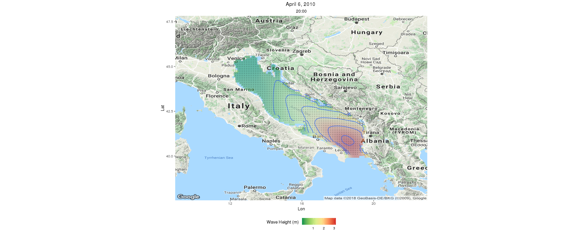
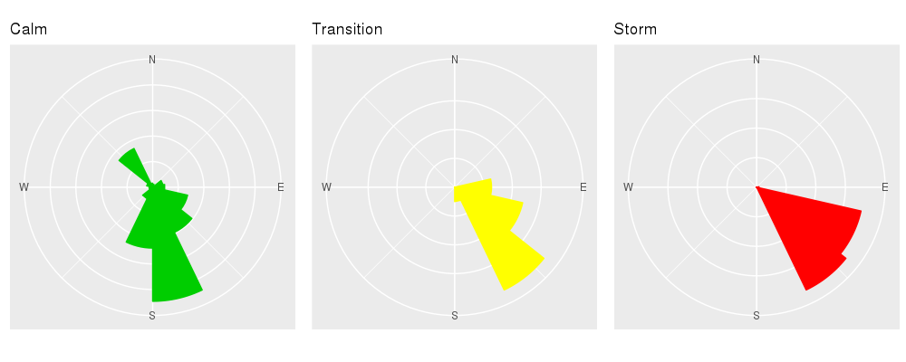
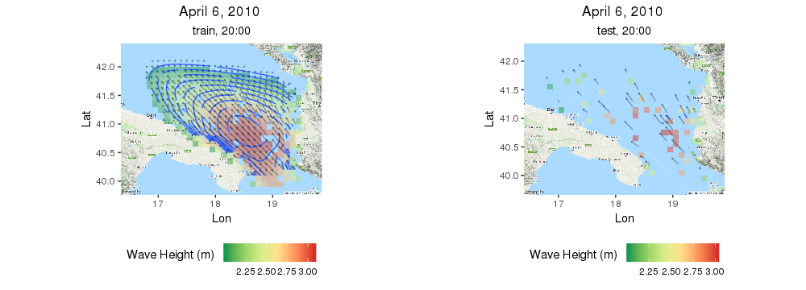
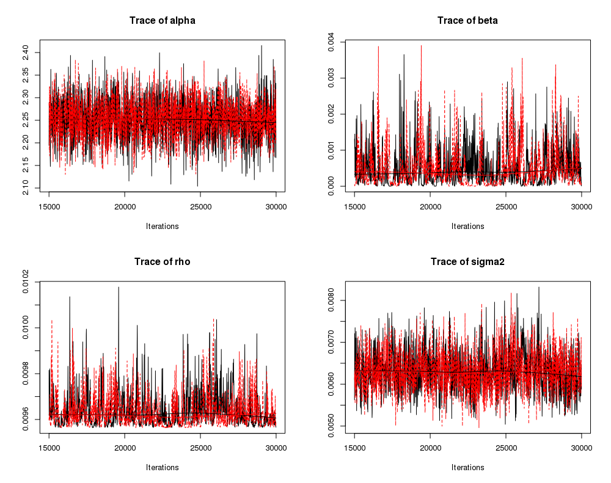
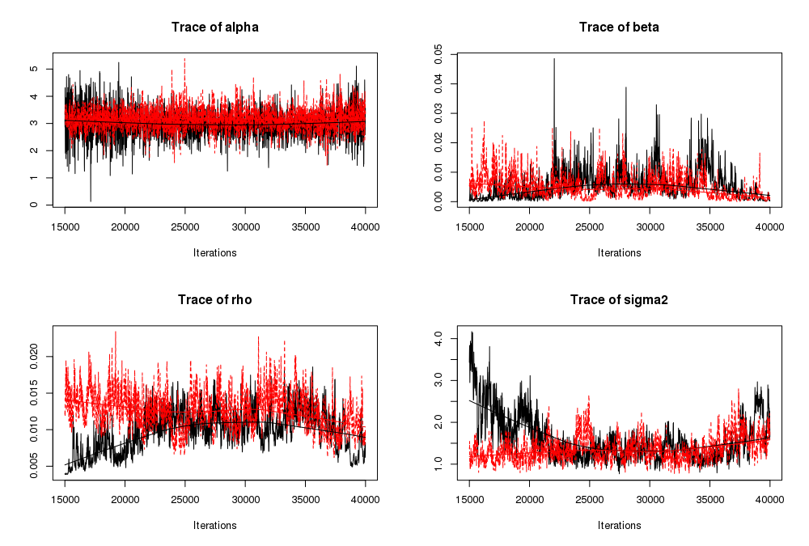
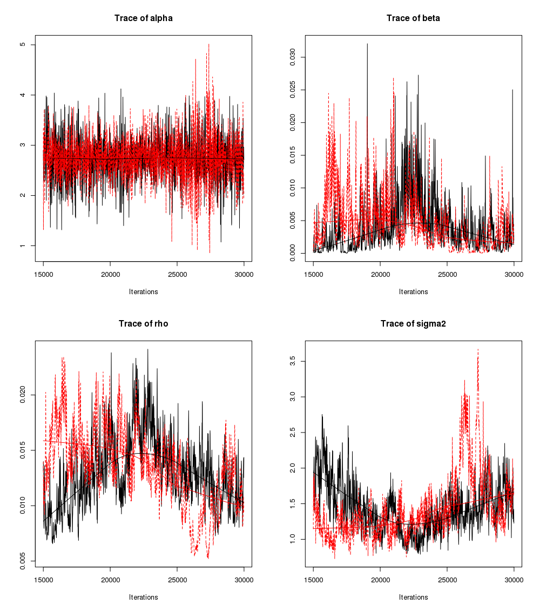
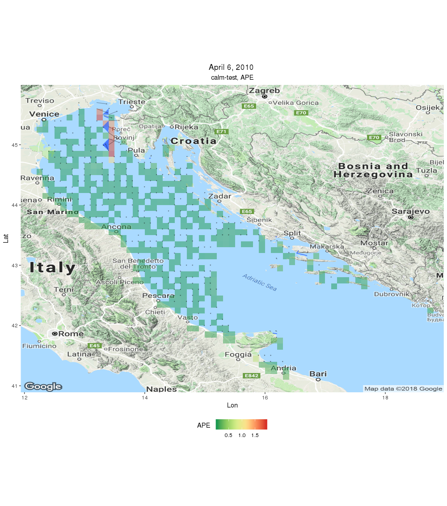

```{r setup, include = FALSE}
knitr::opts_chunk$set(
  collapse = TRUE,
  comment = "#>"
)
```

# Abstract   
CircSpaceTime is going to be a new R package that eventually will implement most of the models  recently developed for spatial and spatio-temporal interpolation of circular data. Such data are often found in applications where, among the many, wind directions, animal movement directions, and wave directions are involved.  To analyze such data we need models for observations at locations $\mathbf{s}$ and times $t$, so-called geostatistical models providing structured dependence which is assumed to decay in distance and time.  For example for wave directions in a body of water, we conceptualize a conceptual wave direction at every location and every time.  Thus, the challenge is to introduce structured dependence into angular data. The approach we take begins with models for linear variables over space and time using Gaussian processes.  Then, we use either wrapping or projection to obtain Gaussian processes for circular data.  Altogether, this package will implement first, work developed by Mastrantonio, Jona Lasinio, Gelfand. The models are cast as hierarchical models, with fitting and inference within a Bayesian inference framework. All procedures are written using Rcpp and whenever possible, the computation is parallelized. We use a wave direction dataset as a running example.

# Introduction
CircSpaceTime is an, under development, R package implementing spatial and spatio-temporal models for circular data. As a first step we start with a purely spatial setting, as initially introduced in @Jona2013.

There are different approaches to specify valid  circular distributions, see for example @Jammalamadaka2001. Here we focus on two methods that allow to built a circular distribution starting from  a linear one, namely the wrapping, and the projection.   Under both methods, the resulting distribution has a  complex functional form but introducing a suitable latent variable, the joint distribution of observed and latent variables are easy to handle in a fully Bayesian framework.

## The wrapping approach 

Let ${Y} \in \mathbb{R}$ be a linear random variable with  probability density function (pdf) $f_{Y}(\cdot|\boldsymbol{\psi})$, where $\boldsymbol{\psi}$ is a generic vector of parameters. We can obtain a circular random variable using the following transformation:
\begin{equation} \label{eq:wrap}
\Theta = {Y} \text{ mod } 2 \pi \in [0,2 \pi).
\end{equation}
The pdf of $\Theta$ is 
\begin{equation} \label{eq:w}
f_{\Theta}(\theta|\boldsymbol{\psi}) =\sum_{k= -\infty}^{\infty}f_Y(\theta+2\pi k|\boldsymbol{\psi}).
\end{equation}
Between $Y$ and $\Theta$ there is the following relation: $Y = \Theta+2 \pi K$, where $K$ is called the \emph{winding number}. Equation \eqref{eq:w} wraps $f_Y(\cdot|\boldsymbol{\psi})$ around the unit circle and  $\Theta$ is  called the \emph{wrapped} version of $\mathbf{Y}$ with period $2 \pi$, e.g. if ${Y}$ is normally distributed, then $\Theta$ follows a \emph{wrapped normal} (WN) distribution. 
 It is not easy to work directly with equation \eqref{eq:w},  since it requires the evaluation of an infinite sum.
Following @Coles1998, if we consider $K$ as   (latent) random variable we can see that $f_{\Theta,K}(\theta,k|\boldsymbol{\psi})= f_Y(\theta+2 \pi k|\boldsymbol{\psi})$, i.e.  $f_Y(\theta+2 \pi k|\boldsymbol{\psi})$ is the  joint density of $(\Theta,K)$, and a marginalization over $K$  gives  equation \eqref{eq:w}. The conditional distribution of $K$, needed for the implementation of the MCMC, is easy to handle since it is proportional to :
$f_Y(\theta+2 \pi k|\boldsymbol{\psi})$.
It is then generally   easier to work with the joint density of $\Theta,K|\boldsymbol{\psi}$, with respect to the one of $\Theta|\boldsymbol{\psi}$, since the former does not require the evaluation of the infinite sum. 
 For example if $Y$ is Gaussian, then the joint density of $(\Theta,K|\boldsymbol{\psi})$ is the normal pdf evaluated at $\theta+2 \pi k$.
The wrapping approach can be easily  extended to a multivariate setting @Jona2013. Let $\mathbf{Y} =(Y_1,\dots, Y_p)^{\prime}$ be a $p$-variate vector with pdf $f_{\mathbf{Y}}(\cdot| \boldsymbol{\psi})$, then  $\boldsymbol{\Theta}=(\Theta_1,\dots, \Theta_p)^{\prime}$, with 
$\Theta_i = {Y}_i \text{ mod } 2 \pi \in [0,2 \pi)$
that is a vector of circular variables. 
 \begin{equation} \label{eq:wmulti}
 f_{\boldsymbol{\Theta}}(\boldsymbol{\theta}|\boldsymbol{\psi}) =\sum_{k_1= -\infty}^{\infty}\dots \sum_{k_p= -\infty}^{\infty}  f_{\mathbf{Y}}(\boldsymbol{\theta}+2 \pi \mathbf{k}|\boldsymbol{\psi}).
 \end{equation}
Extending the univariate approach, we can easily find that the full conditional of $\mathbf{K}$ is proportional to $f_{\mathbf{Y}}(\boldsymbol{\theta}+2 \pi \mathbf{k}|\boldsymbol{\psi})$ and the joint density of $(\boldsymbol{\Theta},\mathbf{K})$ has a multivariate functional form. Here again it is easier to  treat $\mathbf{K}$ as a latent variable.


## The projection approach
 
 
Let $\mathbf{Y}= (Y_1,Y_2)$ be a bivariate vector of linear variables with pdf $f_{\mathbf{Y}}(\cdot|\boldsymbol{\psi})$. The unit vector 
$\mathbf{U} = \frac{\mathbf{Y}}{|| \mathbf{Y} ||}$ 
represents a point over the unit circle and  the associated angle $\Theta$, where $U_1 = \cos(\Theta)$ and $U_2= \sin (\Theta)$,  is a circular random variable; we have then
$\tan(\Theta) =\frac{Y_2}{Y_1} = \frac{U_2}{U_1}.$
Since the  period of the tangent   is $\pi$,  inversion of this function, to obtain $\Theta$,  requires some care.   A common choice is the $\mbox{atan}^*$, formally defined in @Jammalamadaka2001, [p. 13], that takes into account the signs of $Y_1$ and $Y_2$ to determine   the right portion of the unit circle where $\Theta$ is located.    
Between $\Theta$ and $\mathbf{Y}$ the following relation exists
${\bf Y} = \begin{bmatrix} Y_{1}\\ Y_{2}\end{bmatrix} =R \begin{bmatrix}\cos\theta\\ \sin\theta\end{bmatrix} = R{\bf U},$
with $R= ||\mathbf{Y}||$. The pdf of $\Theta|\boldsymbol{\psi}$ is 
\begin{equation} \label{eq:dproj}
f_{\Theta}(\theta|\boldsymbol{\psi}) = \int_{\mathbb{R^+}} r f_{\mathbf{Y}} ((r\cos(\theta),r \sin(\theta))^{\prime}|\boldsymbol{\psi}) d r.
\end{equation}
The integral in equation \eqref{eq:dproj}  is not easy to solve and, even when  a closed form exists, the resulting pdf has  a complicated functional structure. 

For example if $\mathbf{Y} \sim N_2(\boldsymbol{\mu},\boldsymbol{\Sigma})$, with $\boldsymbol{\mu}=(\mu_1,\mu_2)^{\prime}$ and 
 $$
 \boldsymbol{\Sigma} =\left(
 \begin{array}{cc}
 \sigma_1^2& \rho \sigma_1 \sigma_2\\
  \rho \sigma_1 \sigma_2 & \sigma_1^2
 \end{array}
 \right),
 $$
  then  @Wang2013
 $$
 f_{\Theta}(\theta|\boldsymbol{\psi}) = \frac{\phi_2(\boldsymbol{\mu}|\mathbf{0}_2,\boldsymbol{\Sigma})+a D(\theta) \Phi(D(\theta)|\mathbf{0}, \mathbf{I}_2) \phi(a C(\theta)^{-\frac{1}{2}} (\mu_1 \sin(\theta))-\mu_2 \cos(\theta)   )  }{C(\theta)},
 $$
 where $\phi_n(\cdot|\cdot,\cdot)$ and $\Phi_n(\cdot|\cdot,\cdot)$ are, respectively,  the $n-$variate normal pdf and cumulative density function,  with
 \begin{align}
 &a=  \left(\sigma_1\sigma_2 \sqrt{1-\rho^2}\right)^{-1},\\
 &C(\theta) = a^2\left( \sigma_2^2\cos^2(\theta) +\sigma_1^2\sin^2(\theta) -\rho \sigma_1 \sigma_2 \sin (2 \theta)  \right),\\
 &D(\theta) = a^2 C(\theta)^{-\frac{1}{2}} \left(  \mu_1 \sigma_2   (\sigma_2 \cos (\theta)- \rho \sigma_1 \sin (\theta))+  \mu_2 \sigma_1   (\sigma_1 \sin (\theta)- \rho \sigma_2 \cos (\theta))    \right).
 \end{align}

The joint density of $\Theta,R|\boldsymbol{\psi}$ is $f_{\mathbf{Y}} ((r\cos(\theta),r \sin(\theta))|\boldsymbol{\psi}),$ and 
 if $\mathbf{Y} \sim N_2(\boldsymbol{\mu},\boldsymbol{\Sigma})$ then $f_{\Theta,R}(\theta,r|\boldsymbol{\psi})= r\phi_2 \left( (r\cos(\theta),r \sin(\theta))^{\prime}|\boldsymbol{\mu},\boldsymbol{\Sigma}  \right).$ 
The projection approach can be easily adapted to obtain a distribution for multivariate circular variable @wang2014. If $\mathbf{Y}$ is a $2p-$variate linear variable, a $p-$variate vector of (projected)  circular variables is obtained with the following transformation:
$\Theta_i =\mbox{atan}^*\left(\frac{Y_{2i }}{Y_{2i- 1}}\right)$, $i=1,\dots,p.$
The pdf of $\boldsymbol{\Theta}|\boldsymbol{\psi}$, where $\boldsymbol{\Theta} = (\Theta_1,\dots ,\Theta_p)^{\prime}$,  is 
\begin{equation} \label{eq:dproj1}
f_{\boldsymbol{\Theta}}(\boldsymbol{\theta}|\boldsymbol{\psi}) = \int_{\mathbb{R^+}} \dots \int_{\mathbb{R^+}}  \prod_{i=1}^p r_i f_{\mathbf{Y}} (\mathbf{y}|\boldsymbol{\psi})  d r_1 \dots d r_p,
\end{equation}
where $r_i= || (y_{2i-1},y_{2i})^{\prime}  ||$ and, in equation \eqref{eq:dproj1}, $\mathbf{y}$ is a function of $\boldsymbol{\theta}$ and $\mathbf{r}=(r_1,\dots,r_p)$.      
In the multivariate case, as in the univariate one, it is generally easier to work with the joint density of $\boldsymbol{\Theta},\mathbf{R}| \boldsymbol{\psi}$ (the integrand in \eqref{eq:dproj1}) than the one of $\boldsymbol{\Theta}| \boldsymbol{\psi}$. 
\noindent For both processes, we assume
$\mathbf{Y}(\mathbf{s})=\boldsymbol{\mu}+\boldsymbol{\omega}(\mathbf{s})+{\varepsilon}(\mathbf{s}).$
where 
with $\boldsymbol{\mu}$ is a mean term, $\boldsymbol{\omega}(\mathbf{s})$ is a Gaussian process
and  ${\varepsilon}(\mathbf{s})$ is the nugget effect. For the wrapped approach $\mathbf{Y}(\mathbf{s})$ is a univariate process, while under the projected it is bivariate.


Let $R(\mathbf{s}) = || \mathbf{Y}(\mathbf{s}) || \in \mathbb{R}^+$ be a (latent) process and $\mathbf{r}=(r(\mathbf{s}_1),\dots , r(\mathbf{s}_n))^{\prime}$ be its $n-$dimensional realization. Then,  instead of $\boldsymbol{\theta}$, we can work with  the joint density of $\boldsymbol{\theta}, \mathbf{r}|\boldsymbol{\psi}$, that is the integrand in \eqref{eq:dproj1}.

## Implementation details
Model parameters are estimated using a MCMC algorithm 
involving  Gibbs sampler and sometimes Metropolis within Gibbs steps. 
It is well known that the MCMC  tends to mix really slow [@Andrieu2010] when latent variable are involved. To speed up the convergence, we try to find an optimal proposal distribution for the Metropolis step using the algorithm described in  @Robert2009, [p. 258]. With the goal of speeding up the MCMC convergence, is suggested to decrease the dimension of the parameters space, that is, do as much marginalization as possible [Banerjee2014}). 
The core estimation is based,  mostly, on loops with thounsands iterations. To improve performances [@wickham2015] we implemented everything in \emph{C$++$} and using \texttt{Rcpp} package we can simplify the integration between C$++$ and  R codes [@Eddelbuettel2011]. In particular we used the \texttt{RcppArmadillo} package [@Eddelbuettel2014] that implement the Armadillo matrix library for it simplicity and elegance [@Eddelbuettel2017],  although the \texttt{RcppEigen} is a bit faster [@Eddelbuettel2015].
For a fast multiple chain estimations we used \texttt{doParallel} package [@doParallel].


# Estimation of a model based on the Wrapped Gaussian
We now consider an example based on  wave directions (and heights). These data are obtained as outputs from a deterministic computer model implemented by Istituto Superiore per la Protezione e la Ricerca Ambientale (ISPRA) [@inghilesi2016]. 
 The computer model starts from a wind forecast model predicting 
 the surface wind over the entire Mediterranean. The hourly evolution of sea wave spectra is obtained by solving energy transport 
 equations using the wind forecast as input. 
 Wave spectra are locally modified using a source function describing the wind energy, the energy redistribution due to nonlinear wave interactions, and energy dissipation 
 due to wave fracture. 
 The model produces estimates every hour on a grid with 10 × 10 km cells (Inghilesi et al. 2016). 
 The ISPRA dataset has forecasts for a total of 4941 grid points over the Italian Mediterranean. Over the Adriatic Sea area, there are 1494 points. 

We now load a list containing 4 data frames each of 35856 rows and 7 columns
\begin{itemize}
 \item{Date:}  Date, format: yyyy-mm-dd
   \item{hour:}  Factor w/ 24 levels corresponding to the 24h, format: 00:00
   \item{Lon, Lat:} decimal longitude and latitude
   \item{Hm0:}   Significant wave heights in meters
   \item{Dm:}  Direction of waves in degrees (North=0)
   \item{state:} Factor w/ 3 levels "calm","transition", "storm", the categories are built on the basis of the wave height: $Hm0\le 1m$ calm, $1<Hm0<2$ transition, $Hm0\ge 2$ storm
\end{itemize}
We now isolate a storm event observed at 8pm of April 6, 2010.

```{r label="load", message=FALSE, echo=TRUE, warning=FALSE, eval = TRUE}
require(CircSpaceTime) 
data(april)
storm1 <- april$apr6.2010[april$apr6.2010$hour == "20:00",]
``` 
 

 
```{r label="plot1", message=FALSE, echo=FALSE, warning=FALSE, cache=TRUE, eval = FALSE}
require(ggmap)
map1 <- ggmap(get_map(location = c(min(storm1$Lon), min(storm1$Lat), max(storm1$Lon), max(storm1$Lat)), zoom = 6),
      base_layer = ggplot(aes(x = Lon, y = Lat, z = Hm0,
                              fill = Hm0),
                          data = storm1)) +
geom_raster(alpha = .5, vjust = - 1, hjust = 1) + 
geom_contour() +
  geom_spoke(radius = scales::rescale(storm1$Hm0, c(.01, .02)), angle = storm1$Dm*pi/180, arrow = arrow(length = unit(.05, 'cm')),alpha=0.3 ) +
  scale_fill_distiller(palette = "RdYlGn") + labs(fill = "Wave Height (m) \n", title = "April 6, 2010 ", subtitle = "20:00") +
  coord_equal(expand = 0) +
  theme(legend.position = 'bottom',  legend.direction = 'horizontal',plot.title = element_text(hjust=0.5), plot.subtitle = element_text(hjust = 0.5))
map1
```

{ width=70% }


We convert the directions into radians
```{r label0"stirm1$Dmr$, message=FALSE, echo=TRUE, warning=FALSE , eval = FALSE}
 storm1$Dmr<-storm1$Dm*pi/180
```

We plot the samples in terms of the sea state

```{r label="rosediag1", message=FALSE, echo=TRUE, warning=FALSE, eval=FALSE}
require(gridExtra)

r1 <- rose_diag(storm1$Dmr[storm1$state == "calm"],
                bins = 15, color = 3, template = "wind_rose") +
  ggtitle("Calm")
r2 <- rose_diag(storm1$Dmr[storm1$state == "transition"],
                bins = 15, color = "yellow", template = "wind_rose") +
  ggtitle("Transition")
r3 <- rose_diag(storm1$Dmr[storm1$state == "storm"],
                bins = 15, col = 2, template = "wind_rose") +
  ggtitle("Storm")
grid.arrange(r1, r2, r3, ncol = 3)
```

{ width=70% }


It is very clear that the variability decreases from \emph{calm} to \emph{storm}, this is very relevant in terms of model choices. (to be completed....)
First we select the  area where the storm is still in full force
```{r label="storm2", message=FALSE, echo=TRUE, warning=FALSE, eval = FALSE}
  storm2 <- storm1[(storm1$state == "storm"),]
```
further it is better  to convert the coordinates into UTM as the estimation algorithm uses euclidean distance.  We also hold out $10\%$ of the locations for validation purposes


```{r label="traintest1", message=FALSE, echo=TRUE, warning=FALSE,cache=TRUE, eval = FALSE}
 nval0 <- round(nrow(storm2)*0.1)
 sample.val0 <- sort(sample(c(1:nrow(storm2)),nval0))
 train0 <- storm2[-sample.val0,]
 test0 <- storm2[sample.val0,]
 coords0 <- storm2[,3:4]
 colnames(coords0) = c("X","Y")
 attr(coords0,"projection") <- "LL"
 attr(coords0,"zone") <- 32
 coords0_2 <- PBSmapping::convUL(coords0,km = T)
 coords0.train <- coords0_2[-sample.val0,]
 coords0.test <- coords0_2[sample.val0,]
 distance_matrix0 <- dist(coords0_2)
```
 We built the distance matrix among grid points to use distances in the definition of prior distribution for the parameter $\rho$. The elements for the definition of prior distributions are organized in a list that will be passed to the function \texttt{WrapSp}.
 The train and test datasets are
```{r label="plot2",message=FALSE,echo=FALSE, warning=FALSE, cache=TRUE, , eval = FALSE}
train0_map <- ggmap(get_map(location = c(min(train0$Lon), min(train0$Lat), 
                                     max(train0$Lon), max(train0$Lat)), 
                        zoom = 8), 
                base_layer = ggplot(aes(x = Lon, y = Lat, z = Hm0,
                                        fill = Hm0),
                                    data = train0)) +
  geom_raster(alpha = .5, vjust = - 1, hjust = 1) + 
  geom_contour() +
  geom_spoke(radius = scales::rescale(train0$Hm0, c(.01, .2)), 
             angle = train0$Dm*pi/180, 
             arrow = arrow(length = unit(.05, 'cm')), alpha=0.3 ) +
  scale_fill_distiller(palette = "RdYlGn") + 
  labs(fill = "Wave Height (m) \n", title = "April 6, 2010 ", 
       subtitle = "train, 20:00") +
  coord_equal(expand = 0) +
  theme(legend.position = 'bottom',  
        legend.direction = 'horizontal',
        plot.title = element_text(hjust=0.5), 
        plot.subtitle = element_text(hjust = 0.5))
test0_map <- ggmap(get_map(location = c(min(test0$Lon), min(test0$Lat),
                                    max(test0$Lon), max(test0$Lat)), 
                       zoom = 8),
               base_layer = ggplot(aes(x = Lon, y = Lat, z = Hm0,
                                       fill = Hm0),
                                   data = test0)) +
  geom_raster(alpha = .5, vjust = - 1, hjust = 1) + 
  geom_contour() +
  geom_spoke(radius = scales::rescale(test0$Hm0, c(.01, .2)), 
             angle = test0$Dm*pi/180, 
             arrow = arrow(length = unit(.05, 'cm')), alpha=0.3 ) +
  scale_fill_distiller(palette = "RdYlGn") + 
  labs(fill = "Wave Height (m) \n", title = "April 6, 2010 ", 
       subtitle = "test, 20:00") +
  coord_equal(expand = 0) +
  theme(legend.position = 'bottom',  
        legend.direction = 'horizontal',
        plot.title = element_text(hjust=0.5), 
        plot.subtitle = element_text(hjust = 0.5))
grid.arrange(train0_map,test0_map,ncol=2)
```

{ width=70% }


We now compute the empirical practical range interval and we are going to use it in the definition of the prior for the $\rho$ parameter. 
```{r label="rhoprior1", message=FALSE, echo=TRUE, warning=FALSE, eval = FALSE}
 rho_max0 <- 3./min(distance_matrix0[which(distance_matrix0 > 0)])
 rho_min0 <- 3./max(distance_matrix0[which(distance_matrix0 > 0)])
```
The function \texttt{WrapSp} produces samples from the Wrapped Normal spatial model  posterior distribution as proposed in @Jona2013 .As inputs it requires  a vector of $n$ circular data in $[0,2\pi]$, a matrix of coordinates and two lists, one of starting values for the MCMC and the other for the prior distributions definition. Further inputs are related to computational options such as the number of chains, if the computation should be parallelized and the numebr of iterations\footnote{see the help file for a detailed description}. The output is a list  of as many lists as the number of chains each with elements
\texttt{alpha, rho, beta, sigma2} vectors with the thinned chains of the simulated model parameters, $k$ a matrix with as many rows as the data and colums the length of thinned chains and \texttt{corr\_fun} a string with the type of spatial correlation chosen.
In our example we choose an exponential correlation and we run 2 chains parallelizing the procedure.

```{r label="run1",message=FALSE, echo=TRUE, warning=FALSE, cache=TRUE, eval = FALSE}
 start0 <- list("alpha"      = c(2*pi,3.14),
	 "rho"     = c(.5*(rho_min0 + rho_max0),.1*(rho_min0 + rho_max0)),
	 "sigma2"    = c(1,0.1),
	 "beta"     = c(.3,0.01),
	 "k"       = rep(0, nrow(train0)))
 storm <- WrapSp(
 x     = train0$Dmr,
 coords    = coords0.train,
 start   = start0 ,
 prior   = list("alpha"      = c(pi,10), # N
 "rho"     = c(rho_min0, rho_max0), #c(1.3,100), # G
 "sigma2"    = c(3,0.5),
 "beta"      = c(1,1,2)  # nugget prior 
 ) ,
 nugget = TRUE,
 sd_prop   = list( "sigma2" = 1, "rho" = 0.3, "beta" = 1),
 iter    = 30000,
  bigSim    = c(burnin = 15000, thin = 10),
 accept_ratio = 0.5,
 adapt_param = c(start = 1000, end = 10000, esponente = 0.95),
 corr_fun = "exponential", 
 n_chains = 2,
 parallel = T,
 n_cores = 2)
 
```

We can control the convergence of the MCMC using the function \texttt{ConvCheck} that  returns an mcmc.list (mcmc) to be used with the \texttt{coda} package and the Potential scale reduction factors (Rhat) of the model parameters computed using the \texttt{gelman.diag} function in the coda package.

```{r label="check1", message=FALSE, echo=TRUE, warning=FALSE, cache=FALSE, eval=FALSE}
check.storm <- ConvCheck(storm, dist = "Wrap")
check.storm$Rhat
```

```{r print_check1, echo=FALSE, message=FALSE, warnings=FALSE, results='asis'}
tabl <- " 
|         | Point est.| Upper C.I. |
|---------|:---------:|-----------:|
| alpha   | 1.00      | 1.01       |
| beta    | 1.00      | 1.01       |
| rho     | 1.00      | 1.01       |
| sigma2  | 1.00      | 1.00       |

Multivariate psrf

1
"
cat(tabl) 
```
and the traceplots always remebering that \texttt{alpha} is a circular variable
```{r label="trace1", message=FALSE, echo=TRUE, warning=FALSE, cache=FALSE, eval=FALSE}
#par(mfrow=c(2,2))
library(coda)
plot(check$mcmc, trace = TRUE, density = FALSE)
```

{ width=70% }

Convergence is clearly achieved we can now proceed to estimate the values on the test sites using the posterior samples we just obtained.
```{r label="krigstorm",message=FALSE, echo=TRUE, warning=FALSE, cache=TRUE, eval = FALSE}
Pred.storm <- WrapKrig(
   WrapSp_out = storm,
## The coordinates for the observed points
  coords_obs = coords0.train,
## The coordinates of the validation points
  coords_nobs = coords0.test,
##the observed circular values
   x_oss = train0$Dmr
 )
```

Once the estimates are obtained we compute the Average Prediction Error again following @Jona2013
```{r label="APEstorm", message=FALSE, echo=TRUE, warning=FALSE, cache=FALSE, eval=FALSE}
APE_storm <- APEcirc( real = test0$Dmr,
                sim = Pred.storm$Prev_out,
                bycol = F
)
APE_storm$Ape
```

```{r label="APEstorm_print", message=FALSE, echo=FALSE, warning=FALSE, cache=FALSE, eval=TRUE}
0.0006645222
```

## Estimation of Wrapped models with large variability
To very how things changes when we have to deal with largere variability we run the same approach on data from the "calm" area. This time as the area includes 708 points, we are going to use 50$\%$ of them for estimation and the remaining for validation.

```{r label="calma1",message=FALSE, echo=TRUE, warning=FALSE, cache=FALSE,eval=FALSE}
calma<-apr6.2010[apr6.2010$state=="calm" & apr6.2010$hour=="20:00",]
calma$Dmr<-calma$Dm*pi/180
nval<-round(0.5*nrow(calma))
sample.val<-sort(sample(c(1:nrow(calma)),nval))
train <- calma[-sample.val,]
test <- calma[sample.val,]

coords <- calma[,3:4]
colnames(coords)=c("X","Y")
attr(coords,"projection")<-"LL"
attr(coords,"zone")<-32
coords2<-PBSmapping::convUL(coords,km=T)
coords.train<-coords2[-sample.val,]
coords.test<-coords2[sample.val,]
distance_matrix<-dist(coords2)
rho_max <- 3./min(distance_matrix[which(distance_matrix > 0)])
 rho_min <- 3./max(distance_matrix[which(distance_matrix > 0)])
 
```
We proceed with a larger number of iterations given the larger variability of observations

```{r label="calmarun1", message=FALSE, echo=TRUE, warning=FALSE, eval=FALSE}
start1 <- list("alpha"      = c(2*pi,3.14),
            "rho"     = c(.5*(rho_min + rho_max),.1*(rho_min + rho_max)),
            "sigma2"    = c(1,0.01),
            "beta"     = c(.3,0.01),
            "k"       = rep(0, nrow(train)))
calm <- WrapSp(
  x     = train$Dmr,
  coords    = coords.train,
  start   = start1 ,
  prior   = list("alpha"      = c(pi,10), # N
                 "rho"     = c(rho_min, rho_max), #c(1.3,100), # G
                 "sigma2"    = c(3,0.5),
                 "beta"      = c(1,1,2)  # nugget prior 
  ) ,
  nugget = TRUE,
  sd_prop   = list( "sigma2" = 1, "rho" = 0.3, "beta" = 1),
  iter    = 70000,
  bigSim    = c(burnin = 60000, thin = 10),
  accept_ratio = 0.3,
  #adapt_param = c(start = 1000, end = 10000, esponente = 0.95),
  corr_fun = "exponential", 
  n_chains=2,
  parallel=T,
  n_cores=2)
```
We check for convergence
```{r label="calmacheck1", message=FALSE, echo=TRUE, warning=FALSE, eval=FALSE}
check.calm <- ConvCheck(calm, dist = "Wrap")
 check.calm$Rhat
```

```{r print_calmacheck1, echo=FALSE, message=FALSE, warnings=FALSE, results='asis'}
tabl <- " 
|         | Point est.| Upper C.I. |
|---------|:---------:|-----------:|
| alpha   | 1.09      | 1.35       |
| beta    | 1.14      | 1.47       |
| rho     | 1.20      | 1.69       |
| sigma2  | 1.02      | 1.02       |

Multivariate psrf

1.43
"
cat(tabl) 
```

```{r label="calmatrace1", message=FALSE, echo=TRUE, warning=FALSE, eval=FALSE}
  library(coda)
  plot(check.calm$mcmc, trace = TRUE, density = FALSE)
```
{ width=70% }

We clearly need to setup an update of the chains, we compute the posterior mean of the four moedl parameters and we use these values to start the two chains again. This time with a smaller number of interations and we use the adaptive algorithm (evita i crash ma devo giustificare meglio)
```{r label="calmarun2", message=FALSE, echo=TRUE, warning=FALSE, eval=FALSE}
start2 <- list("alpha"      = c(3.087,3.14),
             "rho"     = c(0.011225,0.011225),
             "sigma2"    = c(1.5,1.5),
             "beta"     = c(0.005,0.005),
             "k"       = rep(0, nrow(train)))


calm.up = WrapSp(
  x     = train$Dmr,
  coords    = coords.train,
  start   = start2 ,
  prior   = list("alpha"      = c(pi,10), # N
                 "rho"     = c(rho_min, rho_max), #c(1.3,100), # G
                 "sigma2"    = c(3,0.5),
                 "beta"      = c(1,1,2)  # nugget prior 
  ) ,
  nugget = TRUE,
  sd_prop   = list( "sigma2" = 1, "rho" = 0.3, "beta" = 1),
  iter    = 30000,
  bigSim    = c(burnin = 15000, thin = 10),
  accept_ratio = 0.5,
  adapt_param = c(start = 1000, end = 10000, esponente = 0.95),
  corr_fun = "exponential", 
  n_chains=2,
  parallel=T,
  n_cores=2)
```

Again we check the chains convergence:
```{r label="check_calm_up", message=FALSE, echo=TRUE, warning=FALSE, eval=FALSE}
check.calm.up <- ConvCheck(calm.up, dist = "Wrap")
check.calm.up$Rhat
```

```{r label="print_check_calm_up", echo=FALSE, message=FALSE, warnings=FALSE, results='asis'}
tabl <- " 
|         | Point est.| Upper C.I. |
|---------|:---------:|-----------:|
| alpha   | 1.00      | 1.01       |
| beta    | 1.01      | 1.03       |
| rho     | 1.01      | 1.04       |
| sigma2  | 1.03      | 1.03       |

Multivariate psrf

1.03
"
cat(tabl) 
```

```{r label="calmatrace2", message=FALSE, echo=TRUE, warning=FALSE, eval=FALSE}
#par(mfrow=c(2,2))
plot(check.up$mcmc, trace = TRUE, density = FALSE)
```

{ width=70% }

The convergence is reached and we can now move to the estimation on the test set.

```{r label="krigcalma", message=FALSE, echo=TRUE, warning=FALSE, cache=TRUE, eval=FALSE}
Pred.calm = WrapKrig(
   WrapSp_out = calm.up,
## The coordinates for the observed points
  coords_obs = coords.train,
## The coordinates of the validation points
  coords_nobs = coords.test,
##the observed circular values
   x_oss = train$Dmr
 )
```

Once the estimates are obtained we compute the Average Prediction Error again and we can build a map of the APE in each estimated point

```{r label="ape_calm",message=FALSE, echo=TRUE, warning=FALSE, cache=TRUE,eval=FALSE}

APE.calm <- APEcirc(
  real = test$Dmr,
  sim = Pred.calm$Prev_out,
  bycol=F
)
APE.calm$Ape
```

```{r label="print_ape_calm",message=FALSE, echo=FALSE, warning=FALSE, cache=TRUE,eval=TRUE}
0.1398498
```


```{r label="plot3",message=FALSE, echo=FALSE, warning=FALSE, cache=TRUE,eval=FALSE}
test$APE <- APE.calm$ApePoints
require(ggmap)
ggmap(get_map(location = c(min(test$Lon), min(test$Lat), max(test$Lon), max(test$Lat)), zoom = 7),
      base_layer = ggplot(aes(x = Lon, y = Lat, z = APE,
                              fill = APE),
                          data = test)) +
  geom_raster(alpha = .5, vjust = - 1, hjust = 1) + 
  geom_contour() +
  geom_spoke(radius = scales::rescale(test$APE, c(.01, .2)), angle = test$Dmr, arrow = arrow(length = unit(.05, 'cm')),alpha = 0.3) +
  scale_fill_distiller(palette = "RdYlGn") + labs(fill = "APE \n", title = "April 6, 2010 ", subtitle = "calm-test, APE") +
  coord_equal(expand = 0) +
  theme(legend.position = 'bottom',  legend.direction = 'horizontal',plot.title = element_text(hjust=0.5), plot.subtitle = element_text(hjust = 0.5))

```

{ width=60% }

# Estimation of Projected Normal spatial models

Now we will do the predictions on storm example using the Projected Normal (PN) spatial model as reported in @mastrantonio2015b.
The function \texttt{ProjSp} produces samples from the PN. As inputs it requires  a vector of $n$ circular data in $[0,2\pi]$, a matrix of coordinates and two lists, one of starting values for the MCMC and the other for the prior distributions definition. Further inputs are related to computational options such as the number of chains, if the computation should be parallelized and the numebr of iterations\footnote{see the help file for a detailed description}. The output is a list  of as many lists as the number of chains each with elements
\texttt{alpha, rho0, rho, sigma2} vectors with the thinned chains of the simulated model parameters, $r$ a matrix with as many rows as the data and colums the length of thinned chains and \texttt{corr\_fun} a string with the type of spatial correlation chosen.
In our example we choose an exponential correlation and we run 2 chains parallelizing the procedure.

```{r label="run1_PN",message=FALSE, echo=TRUE, warning=FALSE, cache=TRUE, eval = FALSE}
start0_PN <- list("alpha"      = c(0,0,.5,.5),
               "rho0"     = c(.5*(rho_min0 + rho_max0),
                              .1*(rho_min0 + rho_max0)),
               "rho" = c(.05, .1),
               "sigma2"    = c(0.1, .05),
               "r"= abs(rnorm(length(train0$Dmr))))
mod0_PN <- ProjSp(
  x     = train0$Dmr,
  coords    = coords0.train,
  start   = start0_PN ,
  prior   = list("alpha_mu"      = c(0,0),
                 "alpha_sigma"   = diag(10,2),
                 "rho0"     = c(rho_min0, rho_max0),
                 "rho"      = c(-1,1),
                 "sigma2"    = c(3,0.5)),
  sd_prop   = list( "sigma2" = .1, "rho0" = 0.1, "rho" = .1,  "sdr" = sample(.05,length(train0$Dmr), replace = T)),
  iter    = 5000,
  bigSim    = c(burnin = 3500, thin = 1),
  accept_ratio = 0.5,
  adapt_param = c(start = 1000, end = 10000, esponente = 0.95, sdr_update_iter = 50),
  corr_fun = "exponential", 
  n_chains = 2,
  parallel = T,
  n_cores = 2)
```


```{r label="krigPN", message=FALSE, echo=TRUE, warning=FALSE, cache=TRUE, eval=FALSE}
Pred.krig_PN <- ProjKrig(mod0_PN, coords_obs = coords0.train,
                      ## The coordinates of the validation points
                      coords_nobs = coords0.test,
                      ##the observed circular values
                      x_oss = train0$Dmr)
```

We can compare the predictions of the two models using the average prediction error

```{r label="PN_Wrap_comparison", message=FALSE, echo=TRUE, warning=FALSE, cache=TRUE, eval=FALSE}

APE_PN <- APEcirc( real = test0$Dmr,
                sim = Pred.krig_PN$Prev_out,
                bycol = F
)
```

```{r print_APE_comparison, echo=FALSE, message=FALSE, warnings=FALSE, results='asis'}
tabl <- " 
|                           | Wrapped | Projected |
|---------------------------|:-------:|----------:|
| Average Prediction Error  | 0.0007  | 0.0010    |
"
cat(tabl) 
```


# References
